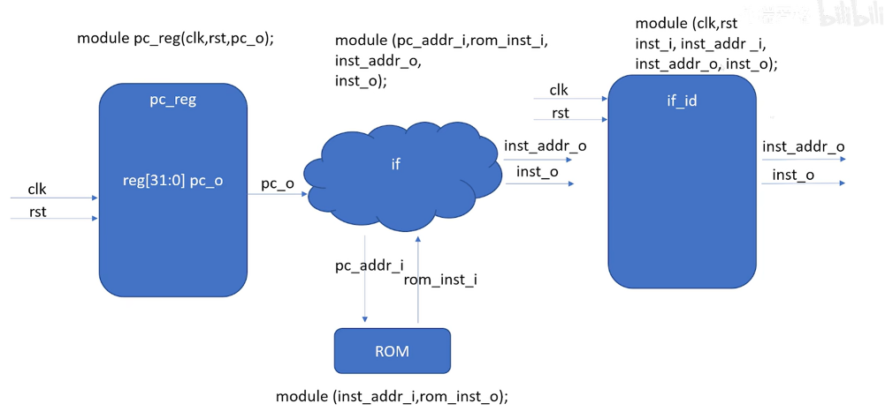
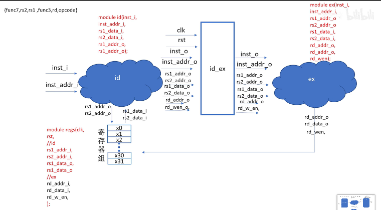
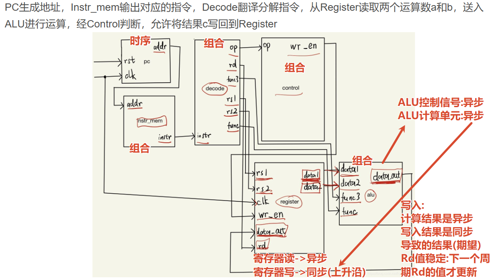

# 1. CPU 设计要求

​	1．要求的CPU设计包含以下16指令：有符号加法（add）、有符号减法（sub）、按位与（and）、按位或（or）、逻辑左移（sll）、逻辑右移（srl）、算数右移（sra）、按位异或（xor）、立即数按位或（ori）、立即数加法（addi）、字加载（lw）、字存储（sw）、等于转移（beq）、不等于跳转（bne）、跳转并链接（jal）和跳转并链接寄存器（jalr）指令。其中，所有指令格式的指令字度均为32位。
​	2．在设计及仿真测流程完毕的基础上，后端flow完成基于InnoVus的APR环境搭建，完成设计初始化并检查网表、时序等，完成FloorPlan阶段对芯面积规划以及IOport的摆放，完成时钟树单元及NDR绕线规则的指定、配置CTS相关参数及设置，配置 Route相关option及参数并完成最终绕线，完成postRoute阶段的优化作，完成PR之后的STA相关作。要求完成后端基本流程实现，并经过多次优化，输出netlist、def和tib等文件。

# 2. RISC-V 指令集

https://blog.csdn.net/sinat_39901027/article/details/119148381

# 3. 三级流水线实现

## 3-1 整体架构

## 3-2 

# 4. 单周期CPU实现

## 4-1 ROM: $readmemb和$readmemh

+ 参考资料： [深入解析Verilog中的$readmemb和$readmemh：从基础到实战-CSDN博客](https://blog.csdn.net/weixin_29159711/article/details/158673746?ops_request_misc=&request_id=&biz_id=102&utm_term=readmemb&utm_medium=distribute.pc_search_result.none-task-blog-2~all~sobaiduweb~default-0-158673746.142^v102^pc_search_result_base5&spm=1018.2226.3001.4187)

## 4-2 寄存器Rigister

RISC-V 规范要求：

- 寄存器读是**异步**的（组合逻辑输出）
  - rs1和rs2都是直接访问寄存器得到值并且直接输出
- 寄存器写是**同步**的（时钟边沿触发）
  - rd的写入需要等待时钟上升沿才行
- 在同一个时钟周期内：先读旧值，后写新值
  - 这种方法使得ALU始终得到新的计算值, 而输出的值在上升沿输入rd,保证rd不会一直变来变去

## 4-3 单周期add指令的总结

+ 第1个上升沿PC写入指令**并且输出指令(异步)**
+ (异步)Decode进行解码, Control进行写入
+ (异步)Rigister输出数据给ALU
+ (异步)ALU进行计算
  + ALU结果在本周期内已经算好
  + 但 register 写入要等 clk 上升沿
+ (同步)ALU写入Rd寄存器(下1个上升沿)

