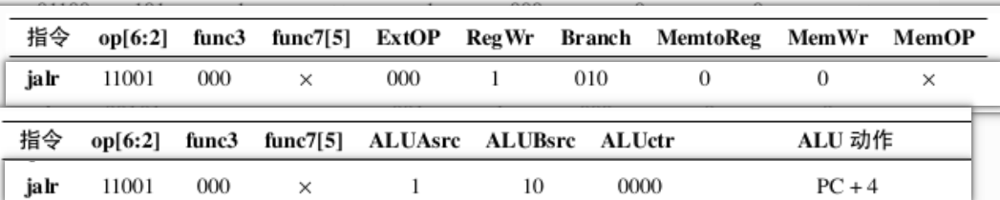
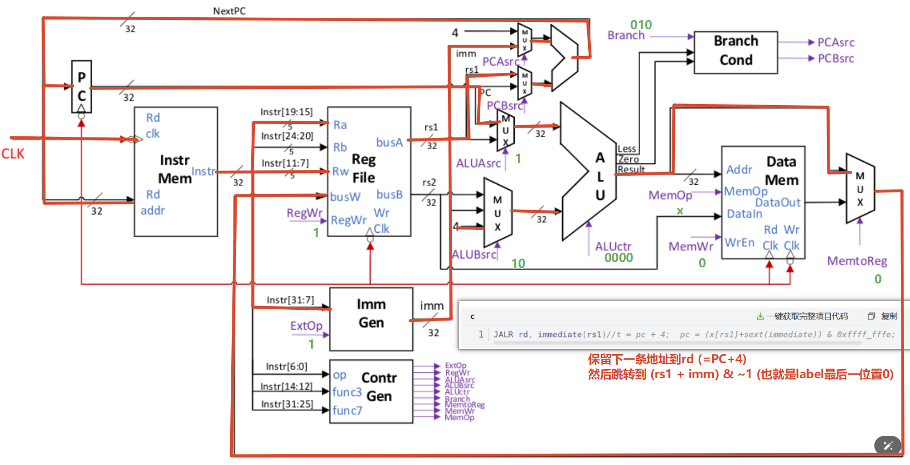
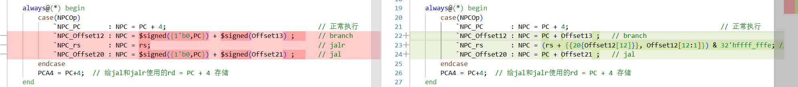

# 1. CPU 设计要求

​	1．要求的CPU设计包含以下16指令：有符号加法（add）、有符号减法（sub）、按位与（and）、按位或（or）、逻辑左移（sll）、逻辑右移（srl）、算数右移（sra）、按位异或（xor）、立即数按位或（ori）、立即数加法（addi）、字加载（lw）、字存储（sw）、等于转移（beq）、不等于跳转（bne）、跳转并链接（jal）和跳转并链接寄存器（jalr）指令。其中，所有指令格式的指令字度均为32位。
​	2．在设计及仿真测流程完毕的基础上，后端flow完成基于InnoVus的APR环境搭建，完成设计初始化并检查网表、时序等，完成FloorPlan阶段对芯面积规划以及IOport的摆放，完成时钟树单元及NDR绕线规则的指定、配置CTS相关参数及设置，配置 Route相关option及参数并完成最终绕线，完成postRoute阶段的优化作，完成PR之后的STA相关作。要求完成后端基本流程实现，并经过多次优化，输出netlist、def和tib等文件。

# 2. RISC-V 指令集

https://blog.csdn.net/sinat_39901027/article/details/119148381

# 3. 单周期CPU实现笔记

## 3-1 ROM: $readmemb和$readmemh

+ 参考资料： [深入解析Verilog中的$readmemb和$readmemh：从基础到实战-CSDN博客](https://blog.csdn.net/weixin_29159711/article/details/158673746?ops_request_misc=&request_id=&biz_id=102&utm_term=readmemb&utm_medium=distribute.pc_search_result.none-task-blog-2~all~sobaiduweb~default-0-158673746.142^v102^pc_search_result_base5&spm=1018.2226.3001.4187)


## 3-2 寄存器Rigister

RISC-V 规范要求：

- 寄存器读是**异步**的（组合逻辑输出）
  - rs1和rs2都是直接访问寄存器得到值并且直接输出
- 寄存器写是**同步**的（时钟边沿触发）
  - rd的写入需要等待时钟上升沿才行
- 在同一个时钟周期内：先读旧值，后写新值
  - 这种方法使得ALU始终得到新的计算值, 而输出的值在上升沿输入rd,保证rd不会一直变来变去


## 3-3 单周期add指令的总结


+ 第1个上升沿PC写入指令**并且输出指令(异步)**
+ (异步)Decode进行解码, Control进行写入
+ (异步)Rigister输出数据给ALU
+ (异步)ALU进行计算
  + ALU结果在本周期内已经算好
  + 但 register 写入要等 clk 上升沿
+ (同步)ALU写入Rd寄存器(下1个上升沿)


# 4. 南京大学资料总结

## 4-1 *RV32I的指令编码类型

- **R-Type** ：为寄存器操作数指令，含2个源寄存器rs1,rs2和一个目的寄存器rd。
- **I-Type** ：为立即数操作指令，含一个源寄存器和一个目的寄存器和一个12bit立即数操作数
- **S-Type** ：为存储器写指令，含两个源寄存器和一个12bit立即数。
- B-Type：为跳转指令，实际是S-Type的变种。与S-Type主要的区别是立即数编码。S-Type中的imm[11:5]变为{immm[12], imm[10:5]}，imm[4:0]变为{imm[4:1], imm[11]}。
- **U-Type** ：为长立即数指令，含一个目的寄存器和20bit立即数操作数。
- J-Type：为长跳转指令，实际是U-Type的变种。与U-Type主要的区别是立即数编码。U-Type中的imm[31:12]变为{imm[20], imm[10:1], imm[11], imm[19:12]}。


### R型 

```c
ADD rd, rs1, rs2 //x[rd] = x[rs1] + x[rs2]
SUB rd, rs1, rs2 //x[rd] = x[rs1] - x[rs2]
AND rd, rs1, rs2 //x[rd] = x[rs1] & x[rs2]
OR rd, rs1, rs2  //x[rd] = x[rs1] | x[rs2]
SLL rd, rs1, rs2 //x[rd] = x[rs1] << x[rs2]
SRL rd, rs1, rs2 //x[rd] = x[rs1] >> x[rs2]
SRA rd, rs1, rs2 //x[rd] = x[rs1] >>> x[rs2]
XOR rd, rs1, rs2 //x[rd] = x[rs1] ^ x[rs2]
```

### I型

+ imm[11:0]直接12位扩展为32位即可(有符号扩展)
  + 在本CPU架构走的是imm32

```c
ORI rd, rs1, immediate //x[rd] = x[rs1] | immediate
ADDI rd, rs1, immediate//x[rd] = x[rs1] + immediate
LW rd，immediate(rs1)  //x[rd] = sext ( M [x[rs1] + sext(immediate) ] [31:0] )
JALR rd, immediate(rs1)//x[rd] = pc + 4;  pc = (x[rs1]+sext(immediate)) & 0xffff_fffe;
```

### S型

+ imm[11:0]直接进行有符号扩展即可
  + 在本CPU架构走的是offset12

```c
SW rs2，immediate(rs1) //M [x[rs1] + sext(immediate) ] =x[rs2][31:0]
```

### B型

+ imm[12:1]需要进行<<1
  + 在本CPU架构中走的是offset13(也就是在顶层实现offset12,在NPC实现offset13)

```c
BEQ rs1，rs2，immediate // if (rs1 == rs2)   pc += sext(immediate )
BNE rs1，rs2，immediate // if (rs1 != rs2)   pc += sext(immediate )
```

### J型

+ imm[20:1]需要进行<<1
  + 在本CPU架构中走的是offset20(专属)在顶层实现offset20,在NPC实现offset21

```c
JAL rd, immediate//x[rd] = pc+4; pc += sext(immediate)
```


## 4-2 通用寄存器

+ 32个: 其中x0恒为0, 在写Register的时候需要特别注意

| Register | Name   | Use                    | Saver  |
| -------- | ------ | ---------------------- | ------ |
| x0       | zero   | Constant 0             | –      |
| x1       | ra     | Return Address         | Caller |
| x2       | sp     | Stack Pointer          | Callee |
| x3       | gp     | Global Pointer         | –      |
| x4       | tp     | Thread Pointer         | –      |
| x5~x7    | t0~t2  | Temp                   | Caller |
| x8       | s0/fp  | Saved/Frame pointer    | Callee |
| x9       | s1     | Saved                  | Callee |
| x10~x11  | a0~a1  | Arguments/Return Value | Caller |
| x12~x17  | a2~a7  | Arguments              | Caller |
| x18~x27  | s2~s11 | Saved                  | Callee |
| x28~x31  | t3~t6  | Temp                   | Caller |


## 4-3 指令分类

+ 整数运算指令
+ 控制转移指令
+ 存储器访问指令


### 特别强调: 跳转指令

| 指令类型             | 立即数字段         | 偏移量计算                               | 地址对齐要求                   | 目标地址计算          |
| :------------------- | :----------------- | :--------------------------------------- | :----------------------------- | :-------------------- |
| **JAL**              | `imm[20:1]` (20位) | `offset = {SignExtend(imm[20:1]), 1'b0}` | 4字节对齐                      | `PC + offset`         |
| **JALR**             | `imm[11:0]` (12位) | `offset = SignExtend(imm[11:0])`         | 2字节对齐（目标地址 LSB 置 0） | `(rs1 + offset) & ~1` |
| **分支 (BEQ,BNE等)** | `imm[12:1]` (12位) | `offset = {SignExtend(imm[12:1]), 1'b0}` | 4字节对齐                      | `PC + offset`         |

## 4-4 数据通路的实现

+ 总图


### R型通路


### I型通路

+ 计算型
  + addi
  + ori


+ 装载型
  + lw


+ 跳转型
  + jalr





### S型通路

+ 仅仅实现sw即可


### B型通路

+ 两条指令
  + beq
  + bne


### J型通路


## 4-5 设计思路分析

+ 参考资料 
+ [从零开始设计RISC-V处理器——单周期处理器的设计_设计riscv处理器-CSDN博客](https://blog.csdn.net/qq_45677520/article/details/122386632)

### 4-5-1 `Instr_mem`:  Rom指令存储器

+ 作为内存存储数据用
+ 与lw 和 sw强相关
+ 是**访存**的重要模块


# 6. 集创赛CPU设计

## 6-1 官方布线细节分析

+ Mux 3to1 模块
  + 从rd, 0和31之间选择一个
  + 本质上是三个模式
    + rd : 正常的R型等指令的寄存器计算和存储
    + 0 : jal和jalr等跳转指令, 不需要保存PC + 4 (也就是纯跳转), 那么就进行写x0的操作,但是x0不准写入(恒为0), 所以实现了纯跳转
    + 31 : 个人猜测应该是x31保存PC + 4比较正规???

+ 


## 6-2 单周期CPU-官方代码修改声明

### 6-2-1 ALU

没什么好说的,本来就是自己实现

### 6-2-2 ControlUnit

重点, 也是自己实现,我新增了Type判断, 这样后续好进行信号类型分析

### 6-2-3 DM

从同步读写,改成了异步读同步写,因为读取本来就是立刻的事情, 否则`执行`步骤会被拖到下一个上升沿,导致单周期设计失效, 使用在设计单周期时,建议就改成**异步读同步写**

### 6-2-4 Ext

​	最无语的模块之一, 仅仅是12为imm扩展成32位,但是问题是12位imm仅仅能用在`I型指令(12位),addi,ori,lw,jalr`, 用处有限, 所以后续考虑改成全能扩展模块, 当前保留设计

### 6-2-5 Flopr + IR 

​	锁存器, 对于单周期CPU来说没有用处, 所以直接不使用

​	既然不使用,那么为了保持顶层模块的最小化修改, 所以将Flopr + IR 的input和output直接assign物理连接,实现该模块的无视

### 6-2-6 IM

​	外设: 内存, 没改

### 6-2-7 MUX选择器

+ MUX_2to1_A
  + 将X,Y的位宽都改为了32位,我觉得赛方设计有问题, 因为如果按照先前的Y为5位位宽, 但是传入的又是32位0, 所以还是改成全32位
+ MUX_3to1_B
  + 没变
+ MUX_3to1_LMD
  + 没变
+ MUX_3to1
  + 没变


### 6-2-8 PC + NPC

- PC: 
  - 暂时不知道为什么rst的时候PC是00002000,所以我将其改成了0000_0000

```c
// PC <= 32'h0000_2000;
   PC <= 32'h0000_0000;
```

+ NPC

  + 修改如下
  + 

  + 并且我觉的NPC和ext模块,赛方设计的很不合理, NPC应该直接进行offset加法, 而不是还需要兼顾位拓展(这应该是EXT需要干的)

### 6-2-9 RF

+ 寄存器外设
+ 赛方设计的很不合理
  + x0不应该是时时刻刻置0
  + 而应该是在底层就拒接写入x0
  + 所以我进行了大改, 后续建议按照这个来

+ 同时我进行了initial, 是为了测试使用, 正式提交需要删除

### 6-2-10 Riscv整体例化

+ 仅仅是将4个Flopr模块和1个IR模块删除掉了, 加入assign进行input 和 output直连
+ 将NPC的参数进行了修改:
  + RD1[31:2]作为输入,参数不匹配
  + 所以我修改成了RD1

### 6-2-11 测试指令集txt

+ 进行了一部分注释
+ 同时注意!!!!!!!!!!!!!!
  + 修改txt的路径


## 6-3 流水线CPU设计

### 6-3-1 细节设计

+ PC更新设计

+ 大多数指令直接PC + 4 , 只有B和J需要在ALU进行计算才知道要不要跳转
  + 不要跳转
    + 那就正常运行
  + 需要跳转
    + 冲刷先前PC + 4的指令:  把流水寄存器写成NOP，让错误路径指令失效
    + 那么NOP本来也就没有什么卵用, 更好
    + Flush细节:

+++

+ 流水线打拍

+ 由于赛方要求不能新增模块, 所以流水线直接的信息传递就无法使用典型的寄存器存储,下一拍传递的方法

  + 解决方法: 

    + 在各个需要信号控制的子模块加入时序逻辑,实现打拍延迟
      + 比如在译码之后(ControlUnit), 所有的信号线(除了zero)都产生了结果, 那么这些信号就直接输入到各个子模块中, EX内的模块打一拍实现, MEM的打2拍实现, WB的打3拍实现
    + 新增多个端口, 然后子模块内部进行打拍, 将各个信号逐级流水传送
    + 我这块选择**第1种**方法,因为对顶层模块的改动最少

  + 实现思路: 把ControlUnit 当作“控制流水寄存器中心”

    + 方案选择: 

      + 要么是Control作为信号发布者, 各个子模块接收到信号后放入打拍器, 每次上升沿取打拍器的out
      + 要么是Control作为信号的总指挥, 内置超级多的打拍器, 然后每次发布out给各个子模块

    + 由于后续还需要处理冒险和flush问题, 所以我暂时选择**第2种**方案

    + **ID 阶段信号**：直接输出（如 `ExtSel`）。

      **EX 阶段信号**：打 1 拍（如 `ALUOp`, `ALUSrcA`, `ALUSrcB`）。

      **MEM 阶段信号**：打 2 拍（如 `DMCtrl`）。

      **WB 阶段信号**：打 3 拍（如 `RFWrite`, `WDSel`）。

+ 那么以上是控制信号的传输方法,但是数据通路需要另想对策:

  + 解决方法:
    + 数据通路还得是下方到各级子模块实现传递, 没办法


我计划的时序控制

+ IM取指阶段本来就存在IR
+ WR直接在RF内部打3拍,等待WB阶段写回
+ RD1,RD2本来就存在锁存1拍
+ MUXB的Imm32和Offset都在MUX内部打1拍
+ 同理, NPC的offset20,offset12和rs都在NPC打1拍, PCA4在内部打2拍, 在WB阶段输入RF
+ ALU_result本来就大1拍
+ DM的WD打1拍
+ RD本来就大1拍


