# 1. CPU 设计要求

​	1．要求的CPU设计包含以下16指令：有符号加法（add）、有符号减法（sub）、按位与（and）、按位或（or）、逻辑左移（sll）、逻辑右移（srl）、算数右移（sra）、按位异或（xor）、立即数按位或（ori）、立即数加法（addi）、字加载（lw）、字存储（sw）、等于转移（beq）、不等于跳转（bne）、跳转并链接（jal）和跳转并链接寄存器（jalr）指令。其中，所有指令格式的指令字度均为32位。
​	2．在设计及仿真测流程完毕的基础上，后端flow完成基于InnoVus的APR环境搭建，完成设计初始化并检查网表、时序等，完成FloorPlan阶段对芯面积规划以及IOport的摆放，完成时钟树单元及NDR绕线规则的指定、配置CTS相关参数及设置，配置 Route相关option及参数并完成最终绕线，完成postRoute阶段的优化作，完成PR之后的STA相关作。要求完成后端基本流程实现，并经过多次优化，输出netlist、def和tib等文件。

# 2. RISC-V 指令集

https://blog.csdn.net/sinat_39901027/article/details/119148381

# 3. 三级流水线实现

## 3-1 整体架构

## 3-2 

# 4. 单周期CPU实现

## 4-1 ROM: $readmemb和$readmemh

+ 参考资料： [深入解析Verilog中的$readmemb和$readmemh：从基础到实战-CSDN博客](https://blog.csdn.net/weixin_29159711/article/details/158673746?ops_request_misc=&request_id=&biz_id=102&utm_term=readmemb&utm_medium=distribute.pc_search_result.none-task-blog-2~all~sobaiduweb~default-0-158673746.142^v102^pc_search_result_base5&spm=1018.2226.3001.4187)

## 4-2 寄存器Rigister

RISC-V 规范要求：

- 寄存器读是**异步**的（组合逻辑输出）
  - rs1和rs2都是直接访问寄存器得到值并且直接输出
- 寄存器写是**同步**的（时钟边沿触发）
  - rd的写入需要等待时钟上升沿才行
- 在同一个时钟周期内：先读旧值，后写新值
  - 这种方法使得ALU始终得到新的计算值, 而输出的值在上升沿输入rd,保证rd不会一直变来变去

## 4-3 单周期add指令的总结

+ 第1个上升沿PC写入指令**并且输出指令(异步)**
+ (异步)Decode进行解码, Control进行写入
+ (异步)Rigister输出数据给ALU
+ (异步)ALU进行计算
  + ALU结果在本周期内已经算好
  + 但 register 写入要等 clk 上升沿
+ (同步)ALU写入Rd寄存器(下1个上升沿)

# 5. 南京大学资料总结

## 5-1 RV32I的指令编码类型

- **R-Type** ：为寄存器操作数指令，含2个源寄存器rs1,rs2和一个目的寄存器rd。
- **I-Type** ：为立即数操作指令，含一个源寄存器和一个目的寄存器和一个12bit立即数操作数
- **S-Type** ：为存储器写指令，含两个源寄存器和一个12bit立即数。
- B-Type：为跳转指令，实际是S-Type的变种。与S-Type主要的区别是立即数编码。S-Type中的imm[11:5]变为{immm[12], imm[10:5]}，imm[4:0]变为{imm[4:1], imm[11]}。
- **U-Type** ：为长立即数指令，含一个目的寄存器和20bit立即数操作数。
- J-Type：为长跳转指令，实际是U-Type的变种。与U-Type主要的区别是立即数编码。U-Type中的imm[31:12]变为{imm[20], imm[10:1], imm[11], imm[19:12]}。

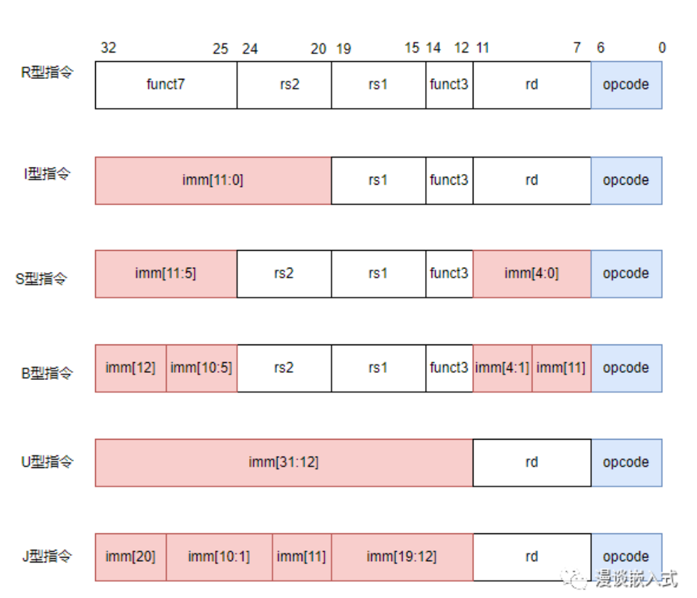

## 5-2 通用寄存器

+ 32个: 其中x0恒为0, 在写Register的时候需要特别注意

| Register | Name   | Use                    | Saver  |
| -------- | ------ | ---------------------- | ------ |
| x0       | zero   | Constant 0             | –      |
| x1       | ra     | Return Address         | Caller |
| x2       | sp     | Stack Pointer          | Callee |
| x3       | gp     | Global Pointer         | –      |
| x4       | tp     | Thread Pointer         | –      |
| x5~x7    | t0~t2  | Temp                   | Caller |
| x8       | s0/fp  | Saved/Frame pointer    | Callee |
| x9       | s1     | Saved                  | Callee |
| x10~x11  | a0~a1  | Arguments/Return Value | Caller |
| x12~x17  | a2~a7  | Arguments              | Caller |
| x18~x27  | s2~s11 | Saved                  | Callee |
| x28~x31  | t3~t6  | Temp                   | Caller |

## 5-3 指令分类

+ 整数运算指令
+ 控制转移指令
+ 存储器访问指令

## 5-4 数据通路的实现

+ 总图

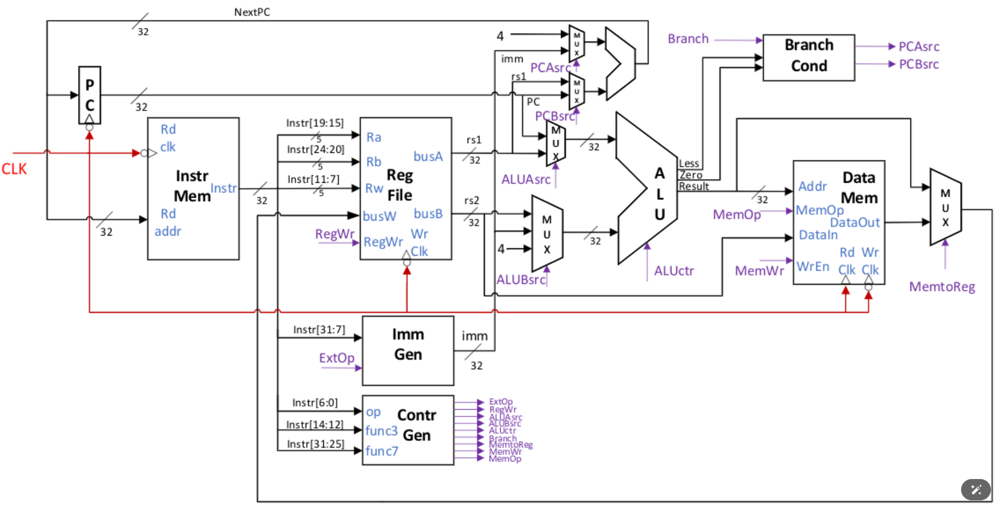

### R型通路

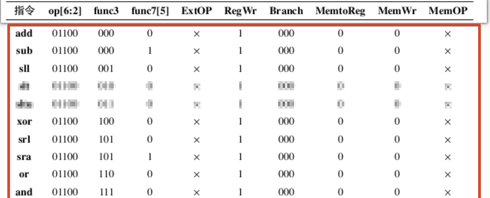

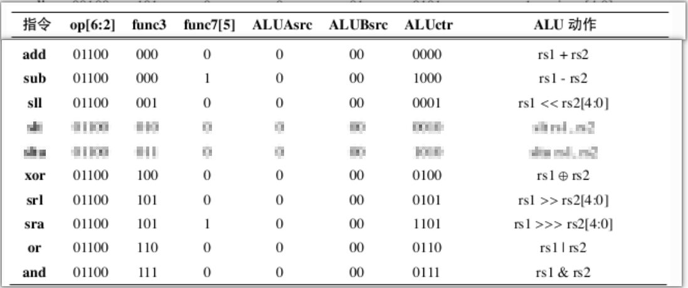

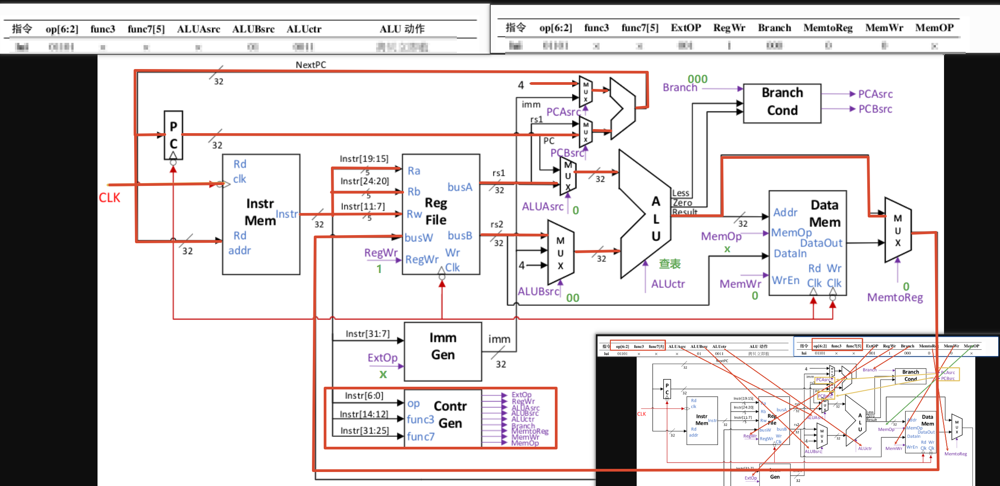

### I型通路

+ 计算型
  + addi
  + ori

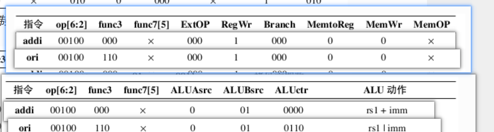

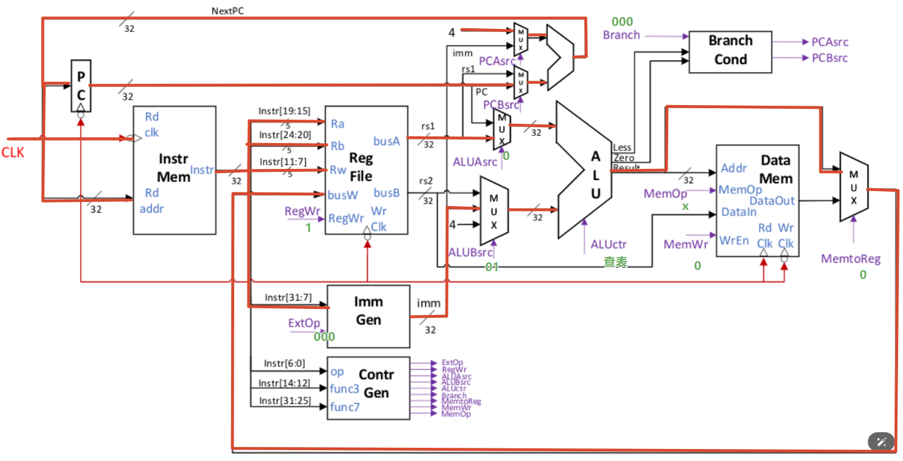

+ 装载型
  + lw

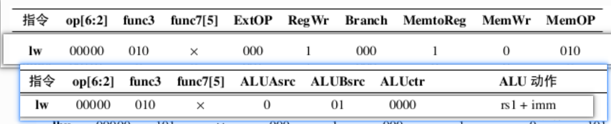

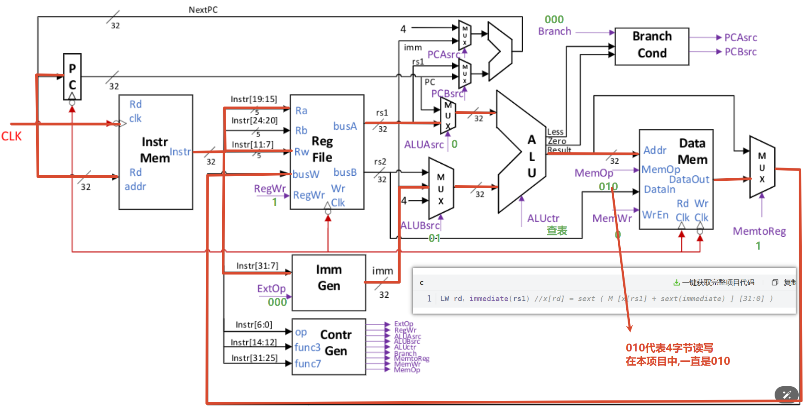

+ 跳转型
  + jalr

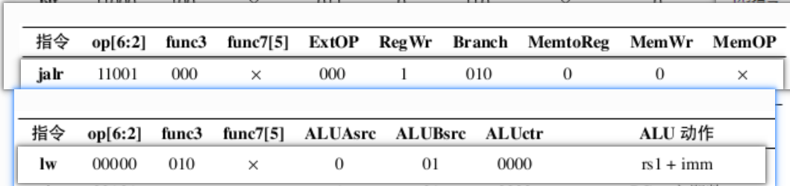

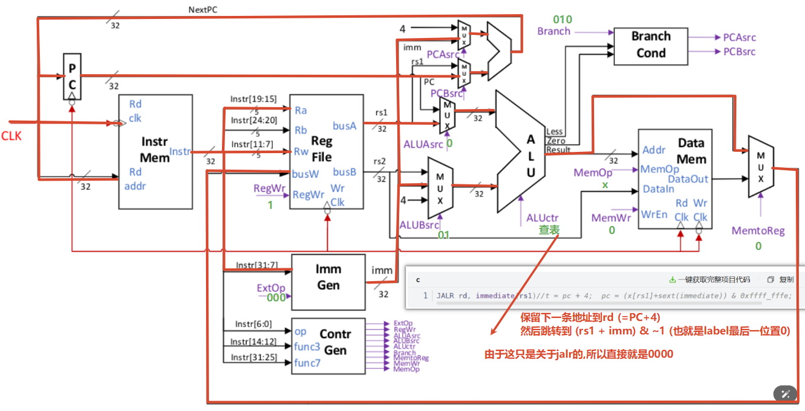

### S型通路

+ 仅仅实现sw即可

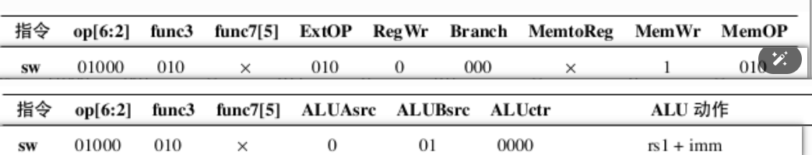

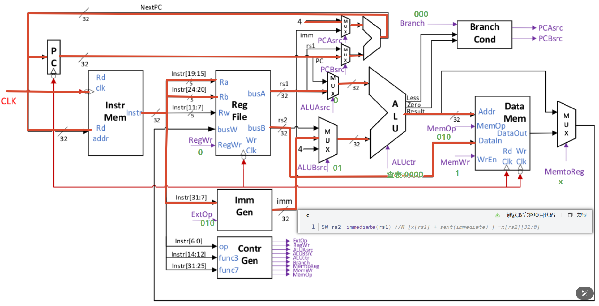

### B型通路

+ 两条指令
  + beq
  + bne

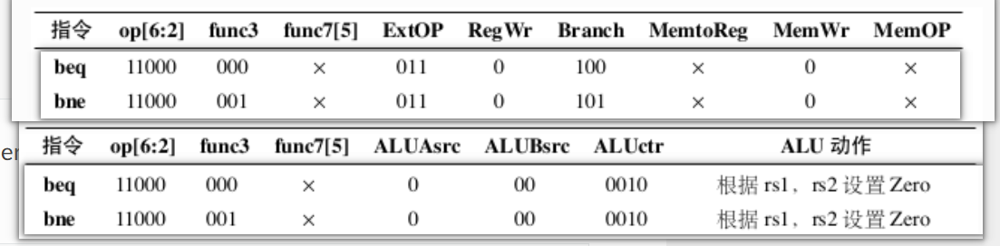

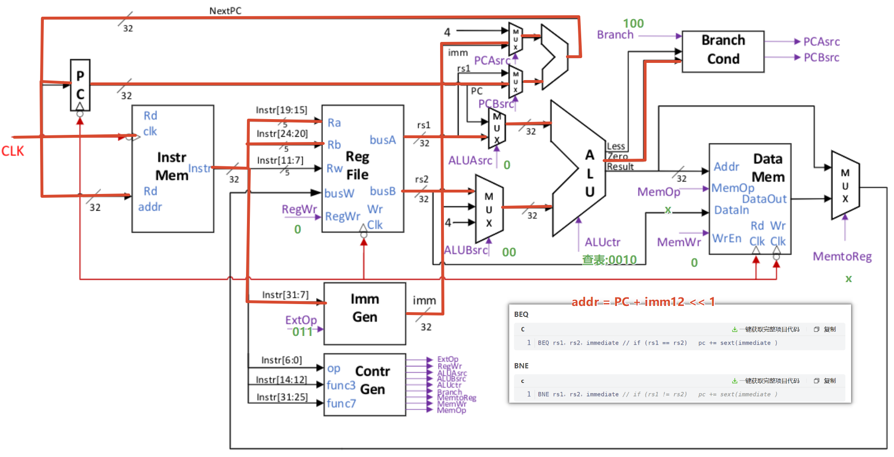

### J型通路

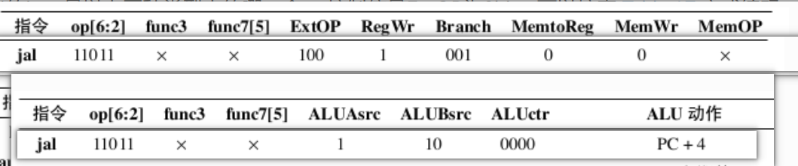

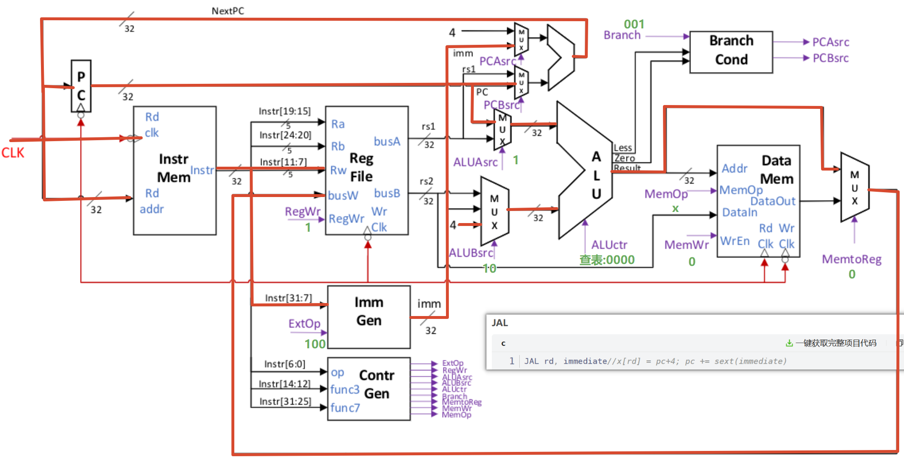

