# 分析报告

+ 指标要求：
  + 要求的CPU设计包含以下16指令：有符号加法（add）、有符号减法（sub）、按位与（and）、按位或（or）、逻辑左移（sll）、逻辑右移（srl）、算数右移（sra）、按位异或（xor）、立即数按位或（ori）、立即数加法（addi）、字加载（lw）、字存储（sw）、等于转移（beq）、不等于跳转（bne）、跳转并链接（jal）和跳转并链接寄存器（jalr）指令。其中，所有指令格式的指令字长度均为32位。
  + 实现赛方code.hex的测试代码

# 一. 16条基础指令实现与分析

## 1. addi

+ 由于Register寄存器未初始化，所以在测试时先赋值x1-x5，进行数据初始化，便于后续计算操作

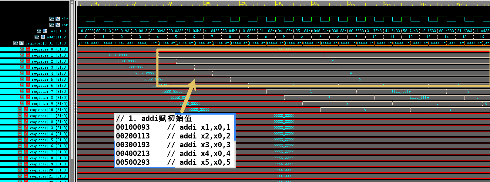

## 2. add

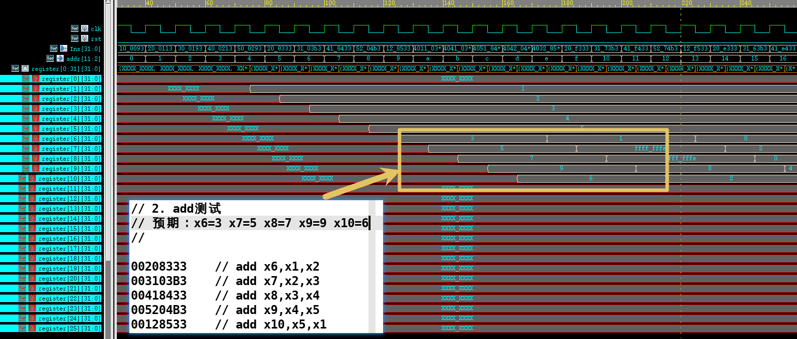

## 3. sub

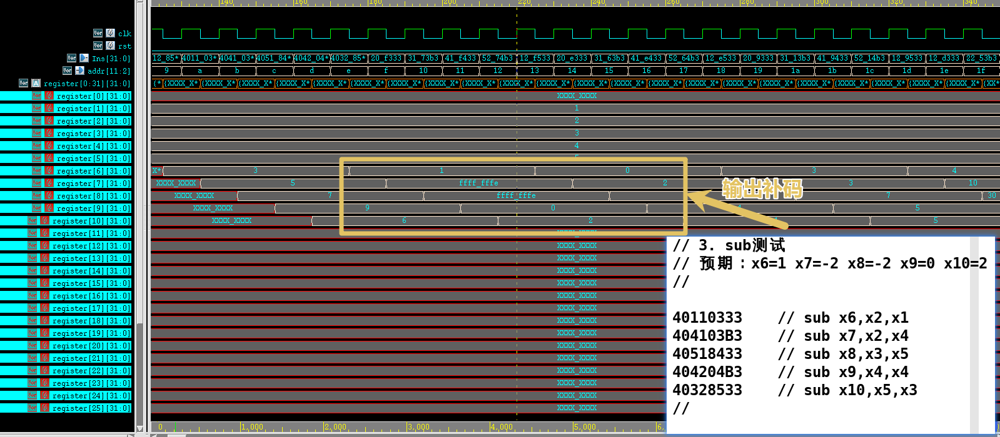

## 4. and

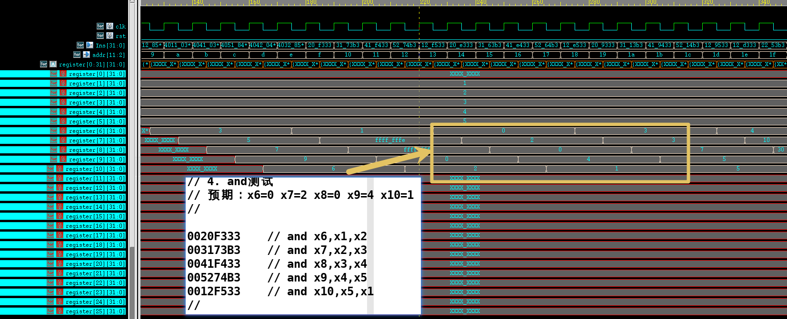

## 5. or

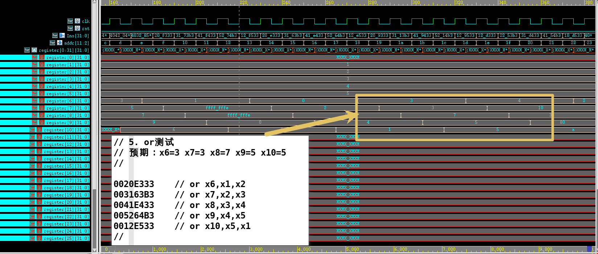

## 6. sll

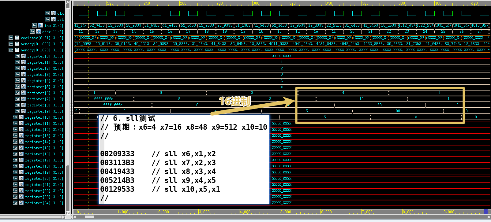

## 7. srl

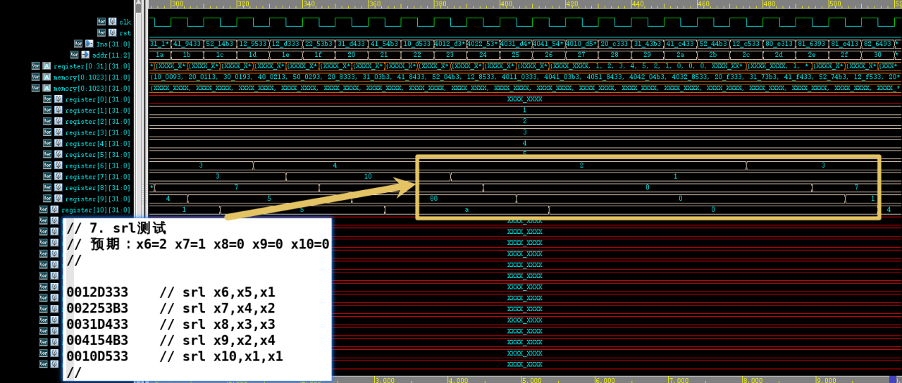

## 8. sra

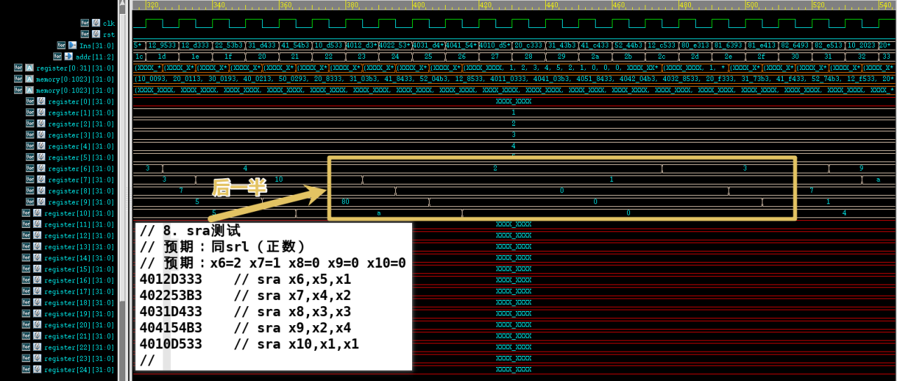

## 9. xor

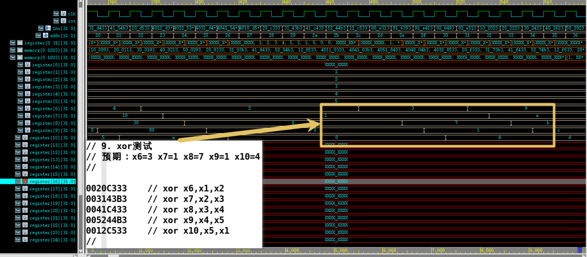

## 10. ori

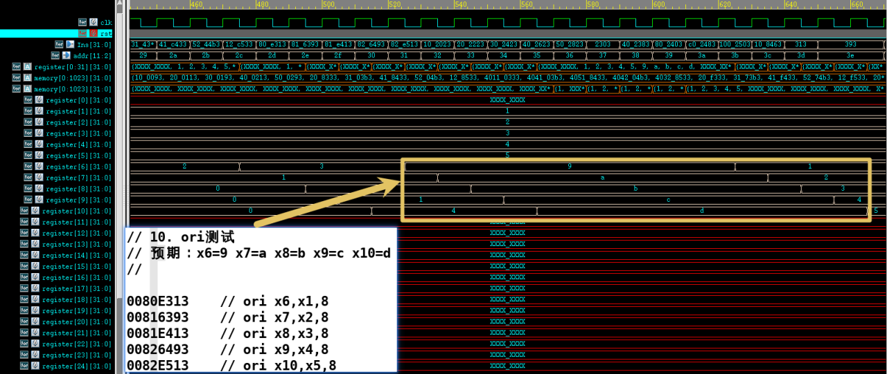

## 11. sw

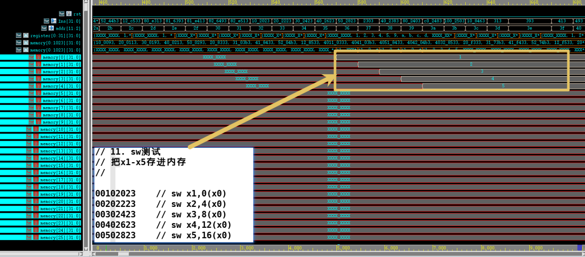

## 12. lw

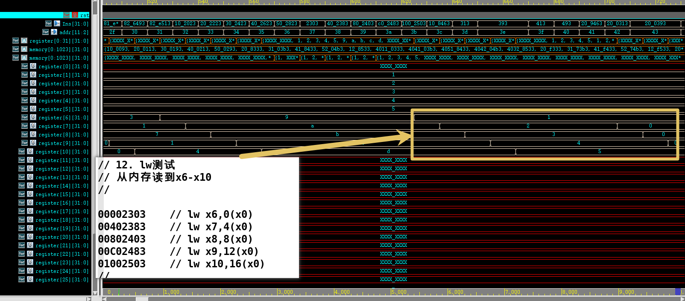

## 13. beq

+ 五级流水线在ID阶段取指，也就是箭头所指为beq的指令编码，再经过ID到达EX，进行zero计算，得到的结果为1，也就是进行跳过处理，因此x6仍然为原值，而不是0（因为被跳过了）

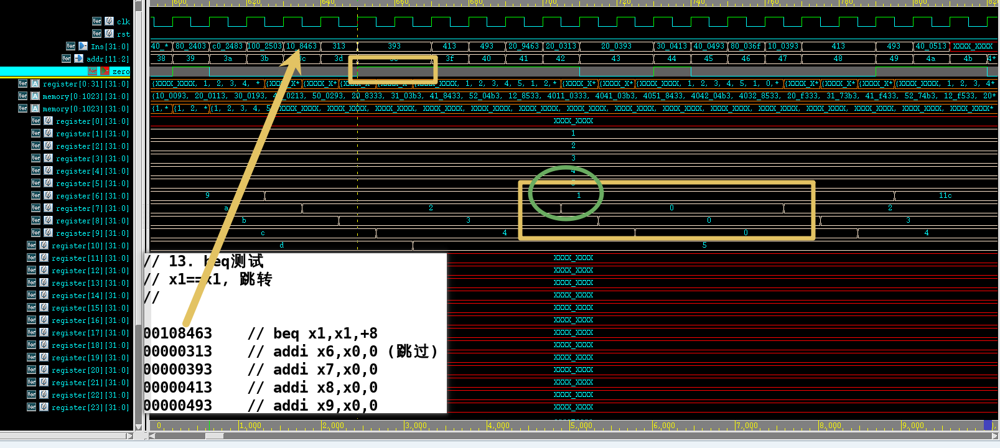

## 14. bne

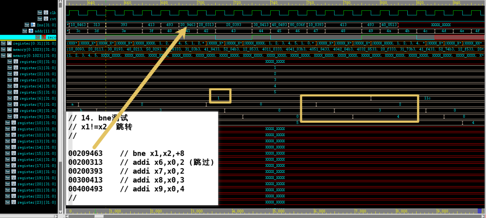

## 15. jal

+ 根据jal的指令译码找到取指(IF)阶段的周期，此时PC为0x118(PC_IF，也就是PC_EX的前两个周期的PC值)，x6 = PC + 4 = 0x11c，因此x6从0变成0x11c，而x7被跳过，x8,x9,x10仍然正常执行

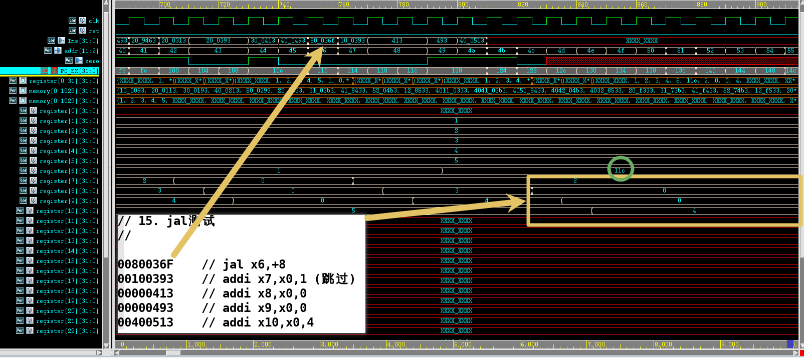

## 16. jalr

+ 由于jalr为绝对地址寻址，所以这里将jalr作为程序运行的第2条指令（PC为0x0000_0004）
+ jalr指令的label = PC + rs ,所以label = 4 + rs = 4 + 16 =  20，所以x7,x8都被跳过，程序跳转到x9，x9运行的结果为3，符合预期

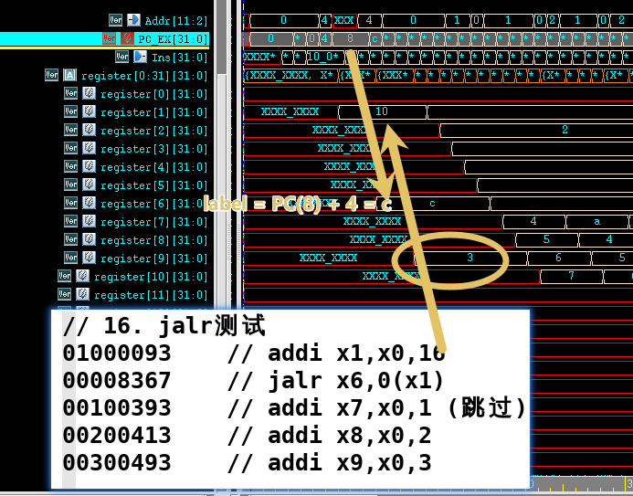

# 二. 数据冒险与控制冒险分析

- 首先初始化x1-x5为1-5

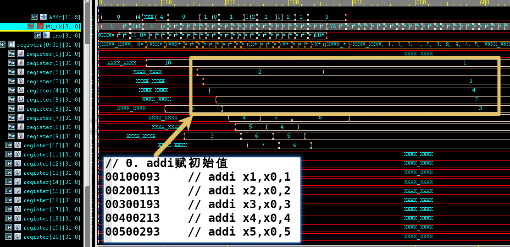

## 1. 数据冒险1（EX前递）

+ 在一个周期开始，EX 阶段要使用上一条处在EX阶段指令的执行结果，此时将 EX/MEM 得到的ALU计算结果前递到muxA和muxB,实现数据前递，所以ALUSrc为010(2)，而addi为I型指令，所以MUXB输入为立即数，不需要数据前递的结果

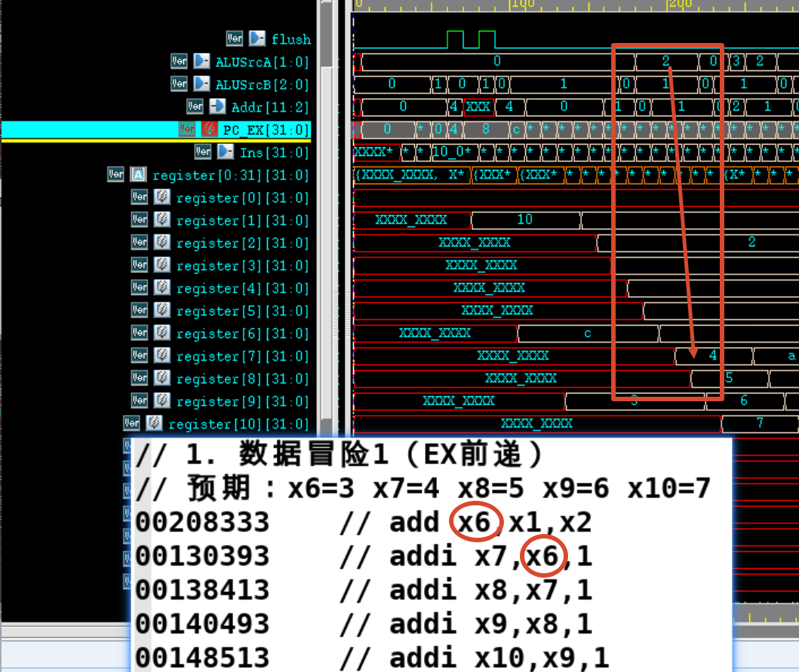

## 2. 数据冒险2（MEM前递）

+ 在一个周期开始，EX 阶段要使用上一条处在 MEM 阶段指令的执行结果，此时将 MEM/WB 阶段的数据前递，所以本条流水线的EX阶段的5个MUX控制信号为：ALUSrcA：00，00，11，10，10 ；ALUSrcB：00(因为为R型，所以B输出RD2)，01,01,01,01(后续都是I型指令，所以输出01，B为立即数)

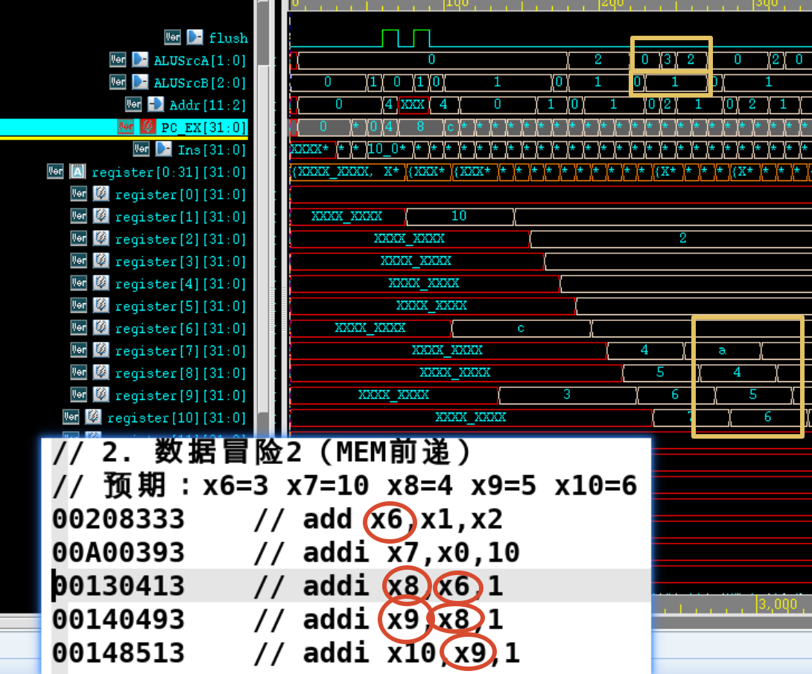

## 3. 数据冒险3（WB寄存器前递）

+ 在一个周期开始，EX 阶段要使用上一条处在 WB 阶段指令的执行结果，此时不需要前递，可以将RD写回变成下降沿写回，因此实现寄存器数据前递

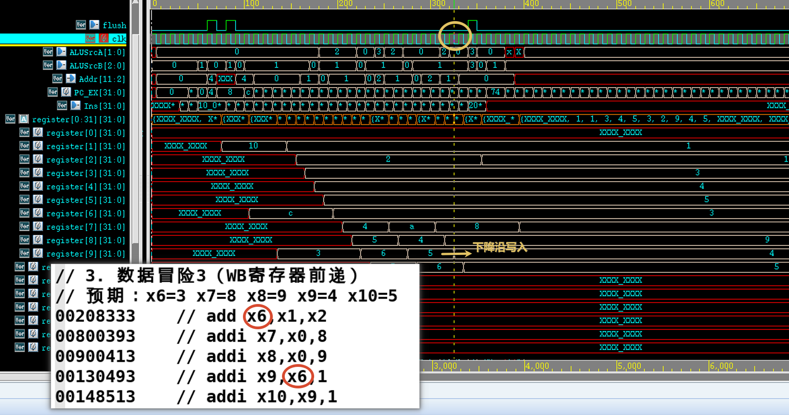

## 4. 控制冒险（beq冲刷）

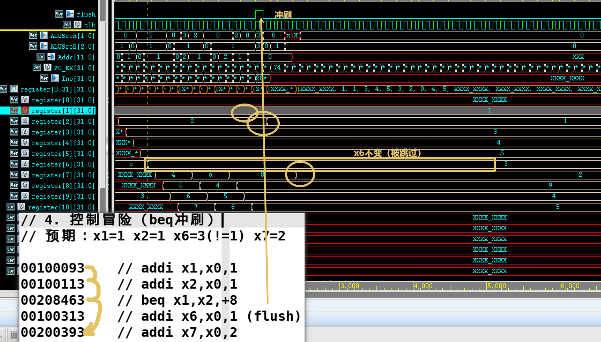

# 赛方代码

