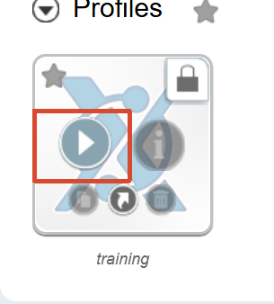
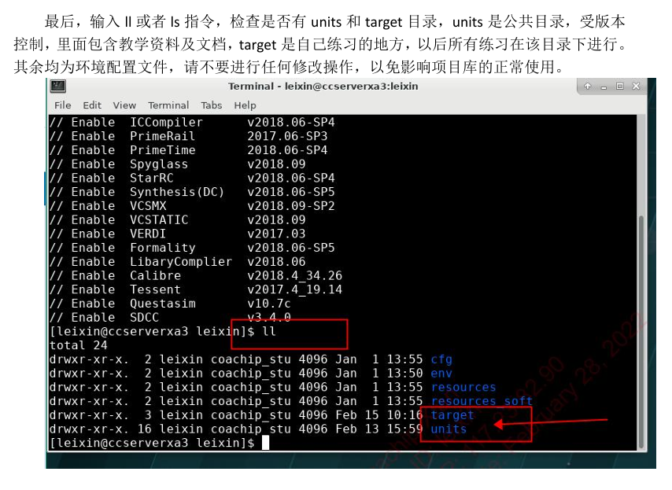
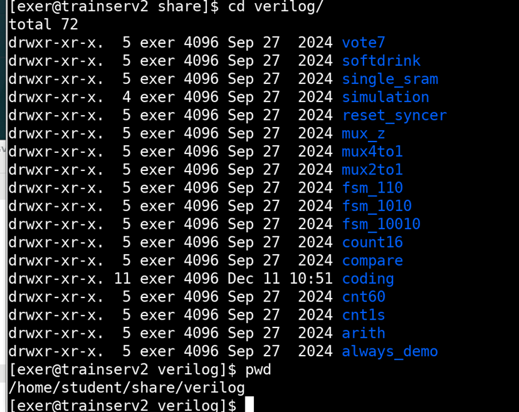
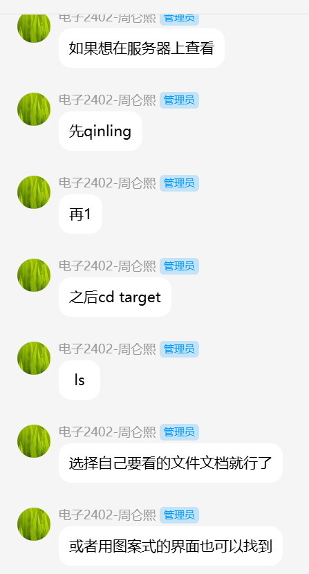

+ 进入链接: (google)

https://coachipxian.coachip.cn:8888/etx/

+ 进入服务器

+ 打开终端
  + 输入 qinling
  + 选1 

+ 进入服务器中输入qinling选择数字1，进入相关项目库，cd target进行代码练习，可以参考verilog部分的基础代码进行EDA工具使用练习；服务器环境中设置只能在target目录下练习，所以需要复制示例代码到target目录下才能启动EDA工具

+ 各式代码
+ 

