# 0. 整体架构

```c
hex/
rtl/
    include/
    ALU.v
    ControlUnit.v
    DM.v
    EXT.v
    Flopr.v
    IM.v
    IR.v
    NPC.v
    PC.v
    RF.v
    Riscv.v
sim/
tb/
```

+ `hex/` → 测试程序
+ `rtl/` → CPU核心代码（重点）
+ `sim/` → 仿真配置
+ `tb/` →` testbench`（测试平台）

# 1. `RTL`核心代码

|   **[📁 includes](#1-0-include)**    |      **[ALU.v](#1-1-aluv)**      | **[ControlUnit.v](#1-2-controlunit.v)** |           **[DM.v](#1-3-DM.v)**           |
| :----------------------------------: | :------------------------------: | :-------------------------------------: | :---------------------------------------: |
|        **[EXT.v](#1-4-extv)**        |    **[Flopr.v](#1-5-floprv)**    |          **[IM.v](#1-6-imv)**           |           **[IR.v](#1-7-irv)**            |
| **[MUX_2to1_A.v](#1-8-mux-2to1-av)** | **[MUX_3to1.v](#1-9-mux-3to1v)** |  **[MUX_3to1_B.v](#1-10-mux-3to1-bv)**  | **[MUX_3to1_LMD.v](#1-12-mux-3to1-lmdv)** |
|       **[NPC.v](#1-13-npcv)**        |      **[PC.v](#1-14-pcv)**       |          **[RF.v](#1-15-rfv)**          |        **[riscv.v](#1-16-riscvv)**        |

## 1-0 Include 

### 1-0-1 `Ctrl-signal-def.V`

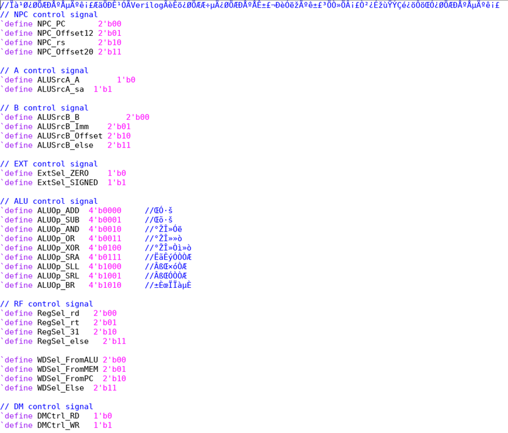

### 1-0-2 `Global-def.v`

```verilog
‘define DEBUG 1
```


### 1-0-3 `Instruction-def.v`

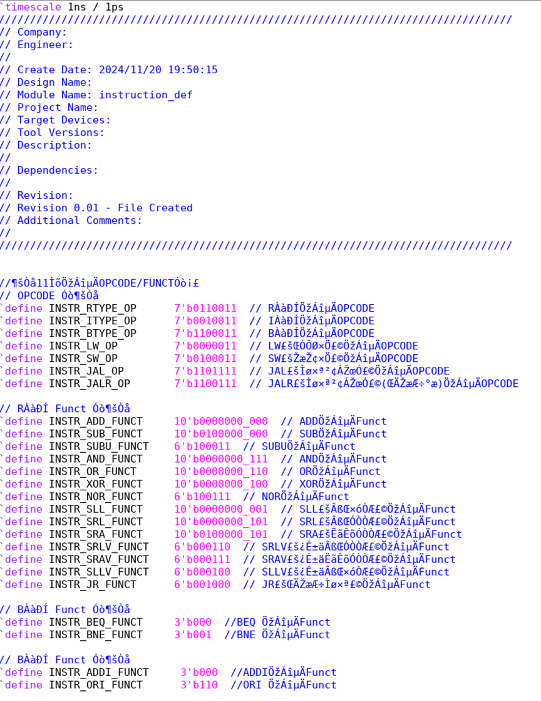

## 1-1 `ALU.v`

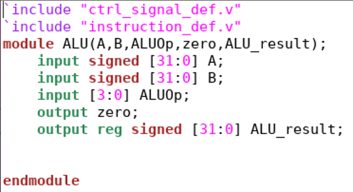

## 1-2 `ControlUnit.v`

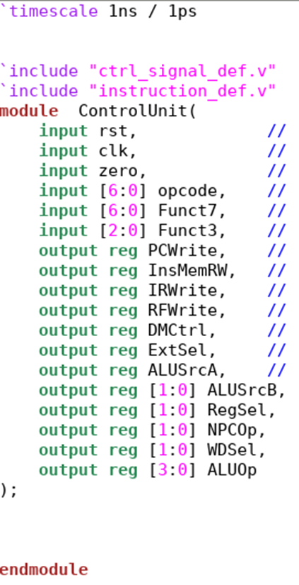

## 1-3 `  DM.v  `

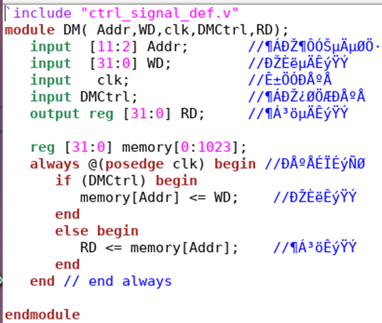

## 1-4  `  EXT.v  `

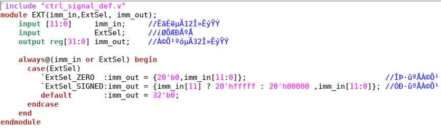

## 1-5 `  Flopr.v  `

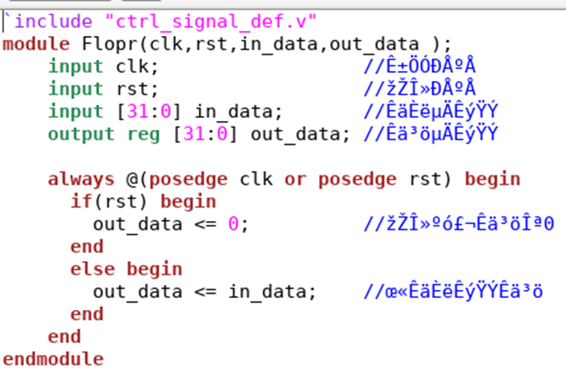

## 1-6  `  IM.v ` 

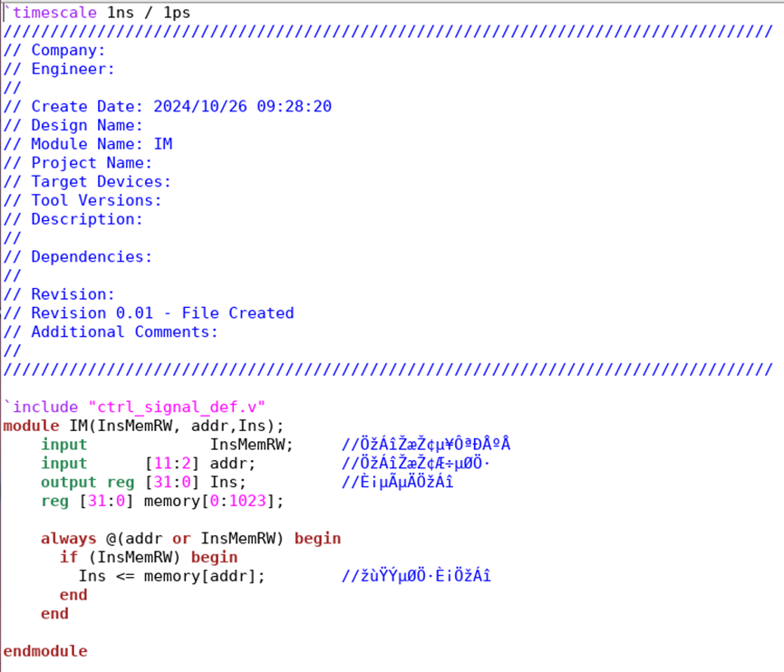

## 1-7 `  IR.v ` 

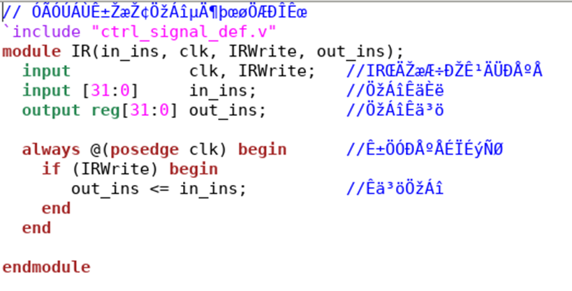

## 1-8  `  MUX-2to1-A.v  `

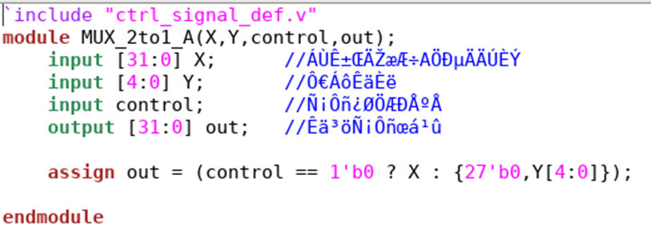

## 1-9 `  MUX-3to1.v ` 

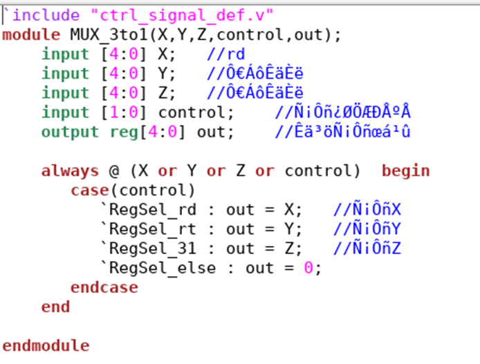

## 1-10  `  MUX-3to1-B.v ` 

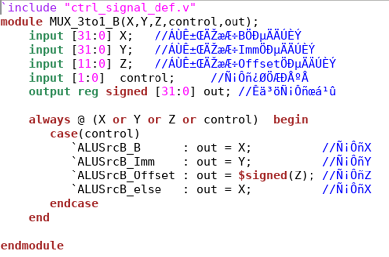

## 1-12 `  MUX-3to1-LMD.v  `

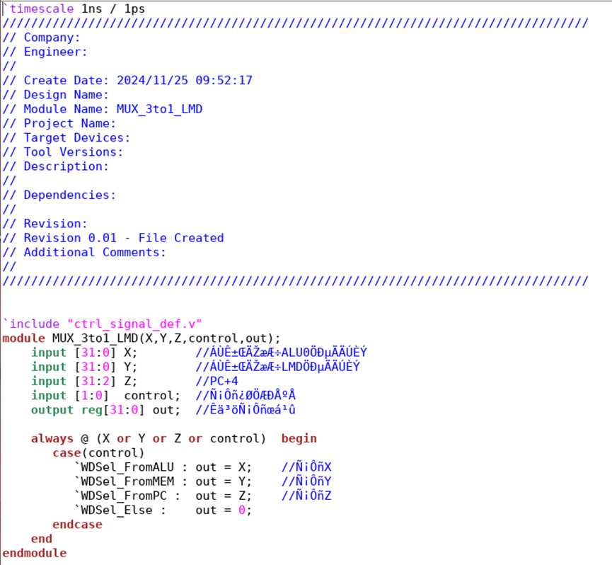

## 1-13 `  NPC.v  ` 

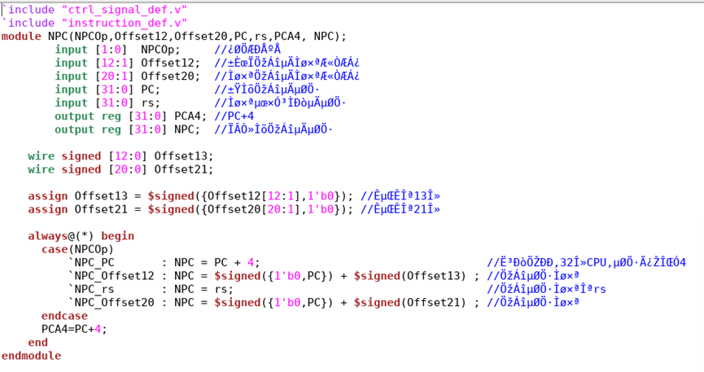

## 1-14 `  PC.v ` 

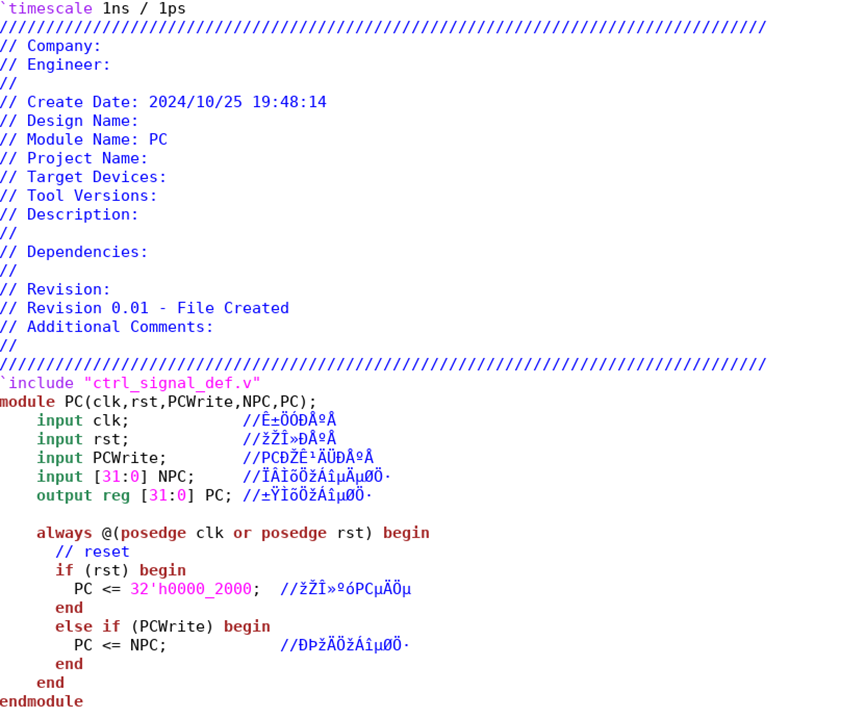

## 1-15 `  RF.v  `

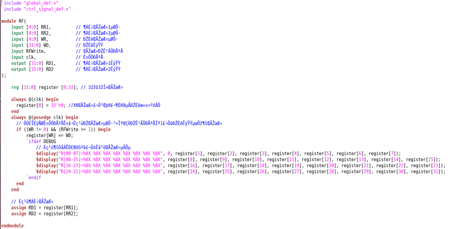

## 1-16 `  Riscv.v ` 

+ 上半部分

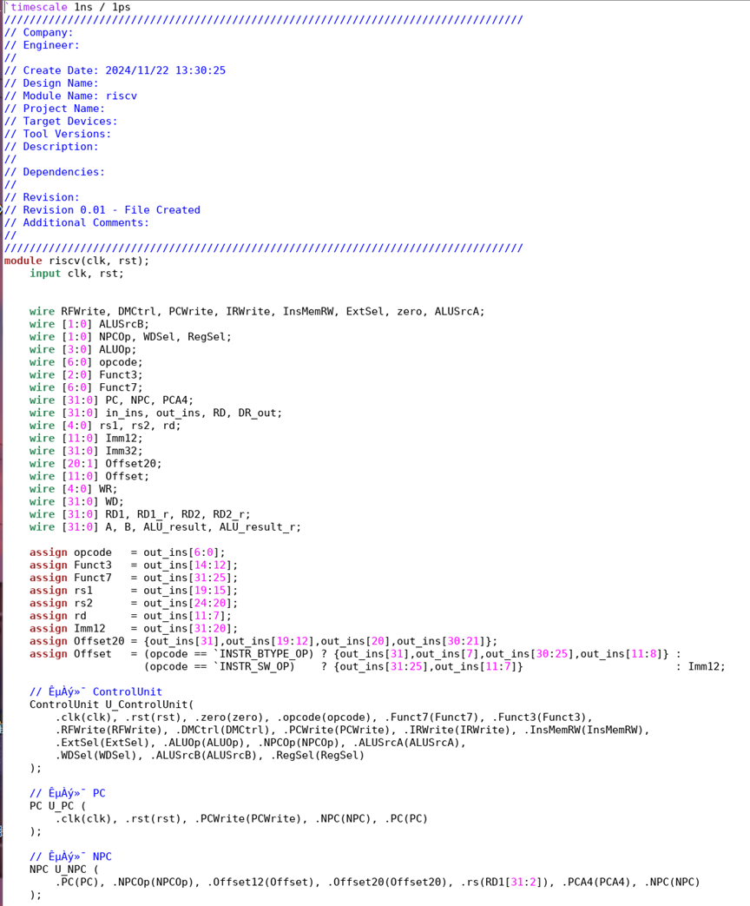

+ 下半部分

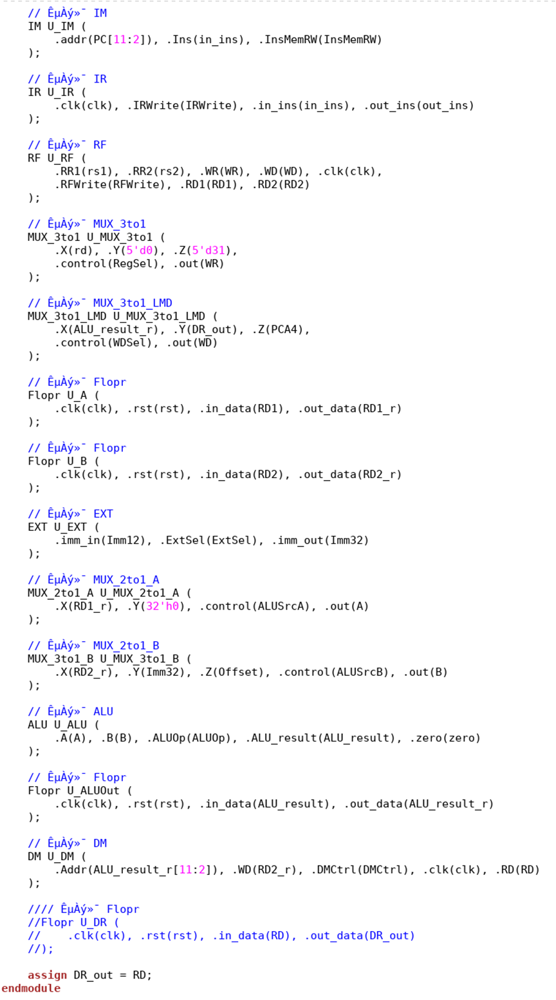

# 2. `Sim`

## 2-1 `Files.f`

+ 这其实就是整体架构

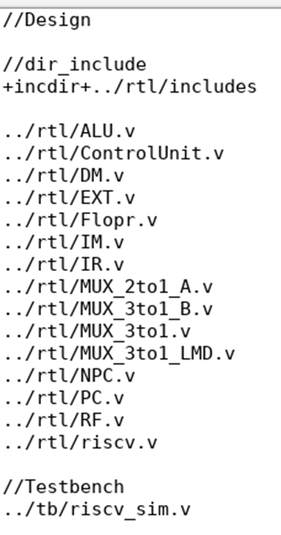

## 2-2 `Makefile`

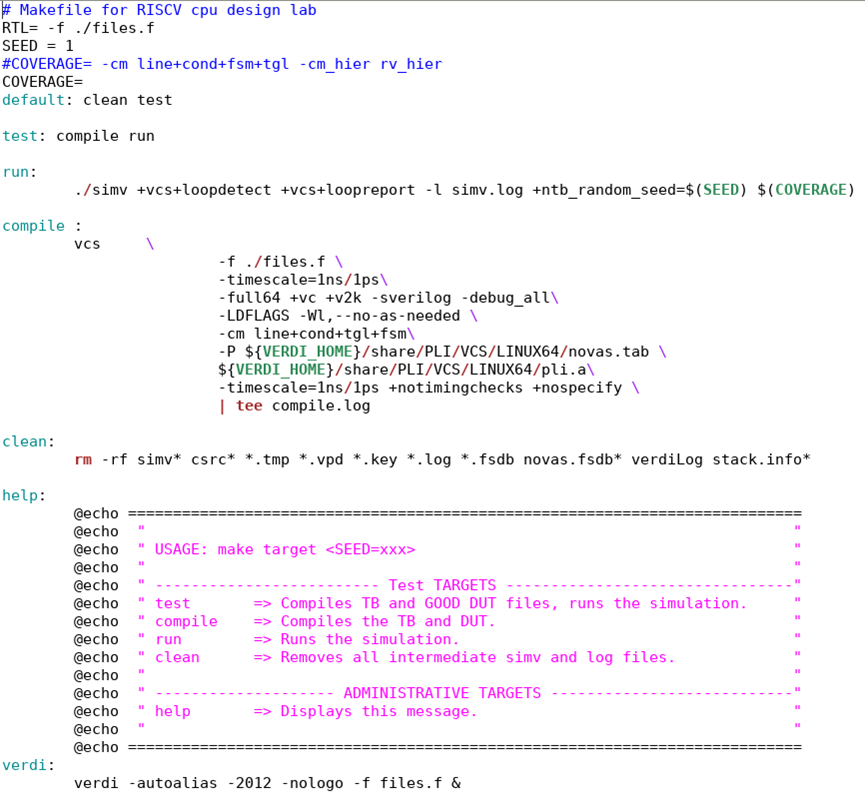

# 3. `Tb`

+ **就是仿真测试**

##  `Riscv-sim.v`

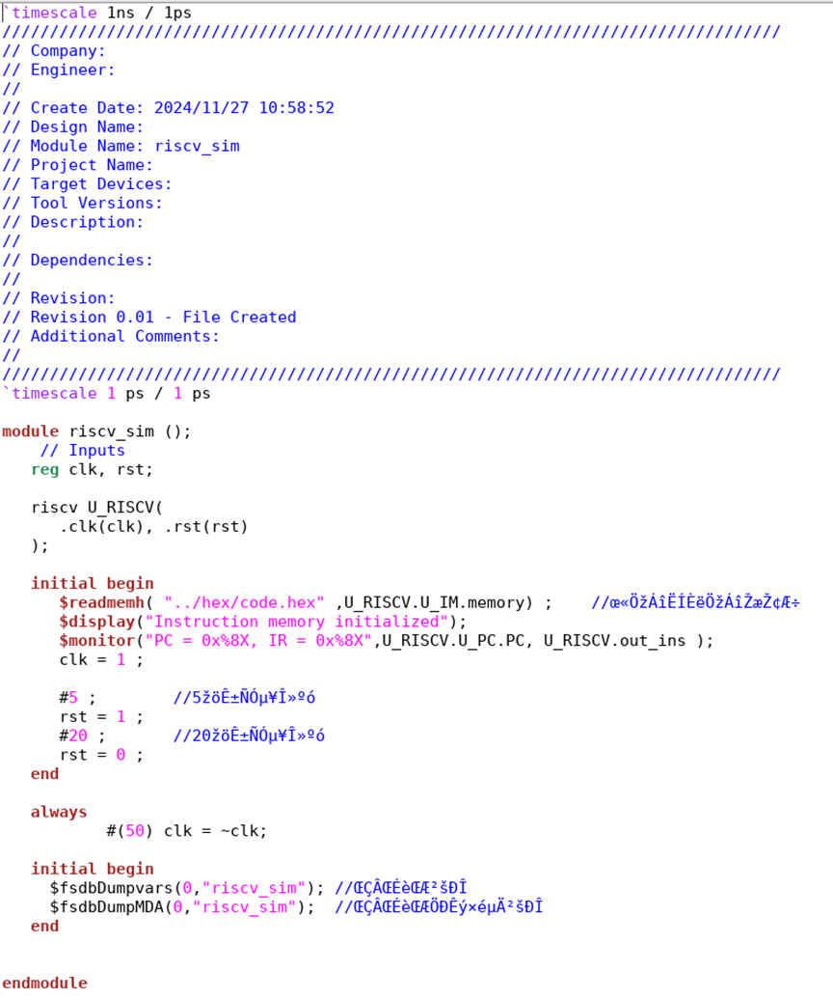